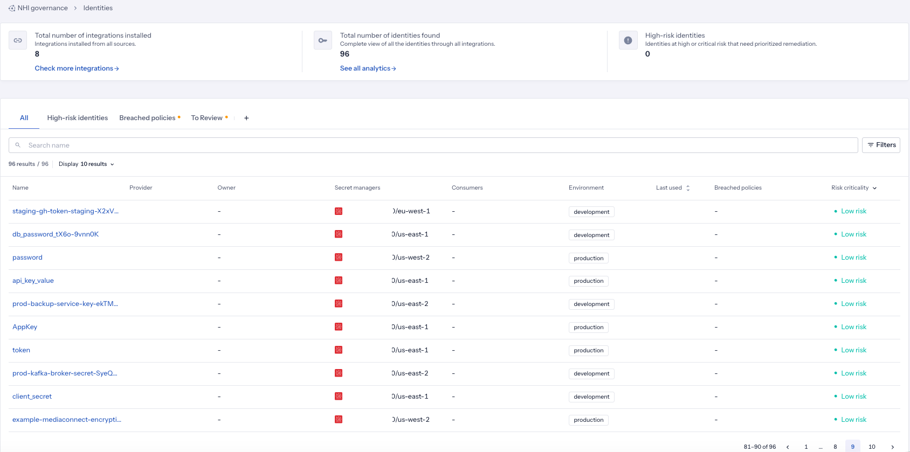
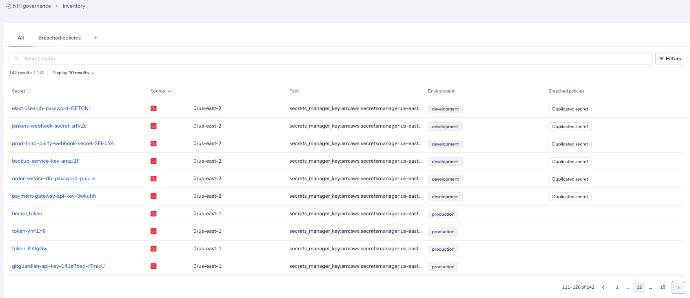
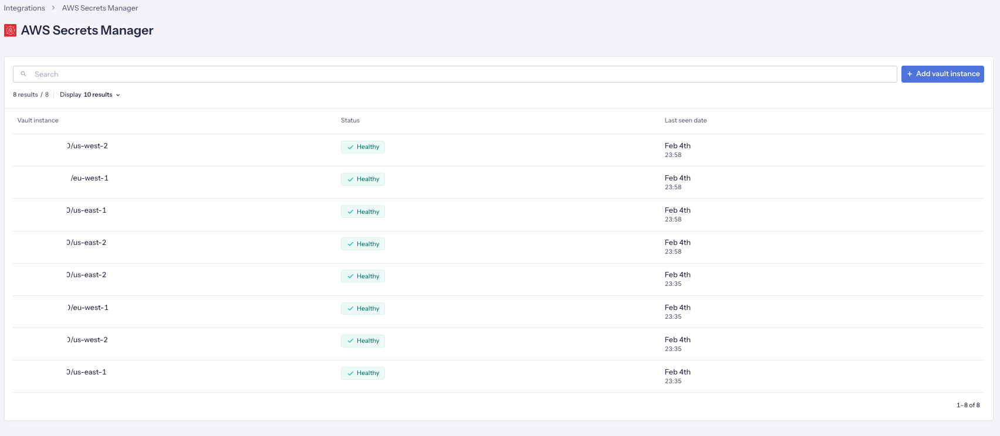
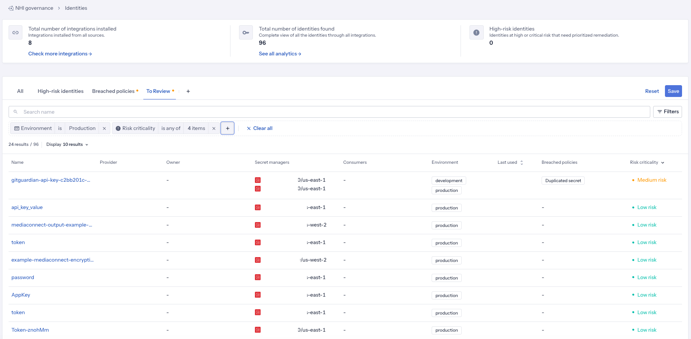
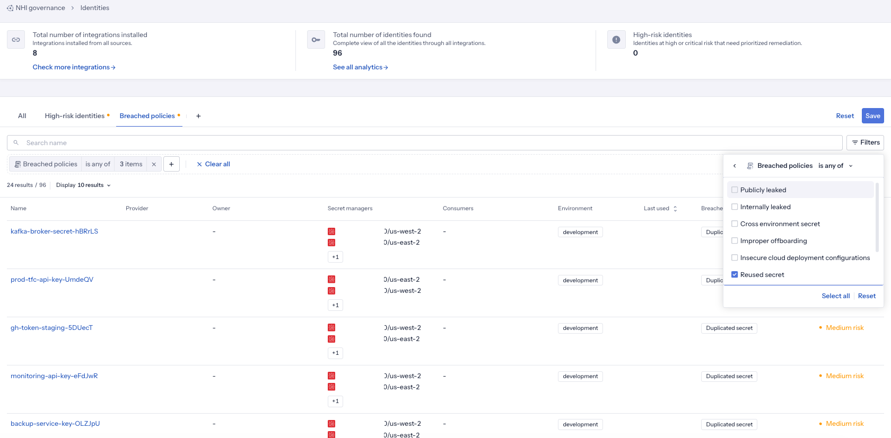
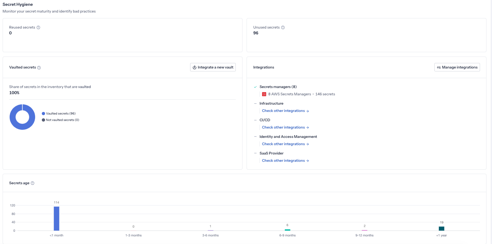

# GitGuardian ggscout Terraform Infrastructure

Terraform configuration that deploys GitGuardian ggscout on AWS using ECS Fargate and EventBridge for scheduled scanning.

## What is ggscout?

GitGuardian Scout (ggscout) is a command-line application that collects secrets and their metadata from your Secrets Managers and synchronizes this data with your GitGuardian platform. It creates an inventory of secrets stored in AWS Secrets Manager, hashes them locally using the HMSL algorithm (secrets never leave your infrastructure in clear text), and reconciles this inventory with secrets detected by GitGuardian.

### Key Capabilities

1. **Extend Detection Coverage**: Detect when vaulted secrets are compromised elsewhere in your perimeter
2. **Improve Incident Prioritization**: Use vault metadata (paths, lease times, environments) to prioritize remediation
3. **Bootstrap Incident Remediation**: Identify and secure unvaulted secrets by pushing them to your Secrets Manager

### AWS Secrets Manager Integration

This deployment configures ggscout to:
- Scan AWS Secrets Manager for secrets inventory
- Hash secrets locally using HMSL algorithm for secure transmission
- Collect metadata like secret names, paths, creation dates, and lease times
- Send hashed data to GitGuardian for reconciliation with detected incidents

**Note**: This deployment is configured in **read-only mode**. The capability to push unvaulted secrets back to Secrets Manager requires additional write permissions and configuration.

### NHI Governance Capabilities

ggscout supports GitGuardian's Non-Human Identity (NHI) governance by providing visibility into:

**Identity Management**


**Secret Inventory & Tracking**


**AWS Secrets Manager Integration**


**Custom Inventory Views**


**Policy Breach Detection**


**Secret Hygiene Monitoring**


## Architecture

- **ECS Fargate**: Runs the ggscout container on a scheduled basis
- **EventBridge**: Triggers ggscout execution based on configurable schedule
- **Secrets Manager**: Secure storage for GitGuardian API key and target for secret scanning
- **CloudWatch**: Logging and monitoring for task execution
- **VPC & Networking**: Isolated network environment with NAT Gateway for secure outbound access

## Prerequisites

1. **AWS CLI** configured with appropriate permissions
2. **Terraform** >= 1.0
3. **GitGuardian API Key** - Obtain from [GitGuardian Dashboard](https://dashboard.gitguardian.com/)

## Documentation

- [What is ggscout?](https://docs.gitguardian.com/ggscout-docs/what-is-ggscout)
- [AWS Secrets Manager Integration](https://docs.gitguardian.com/ggscout-docs/integrations/secret-managers/aws-secrets-manager)

## Quick Start

1. **Deploy**:
   ```bash
   terraform init
   terraform plan
   terraform apply
   ```

2. **Monitor**:
   - Check CloudWatch logs for ggscout execution
   - View task status in ECS console

## Usage

### Configuration

1. **Set variables** in `terraform.tfvars`:
   ```hcl
   gitguardian_api_key = "your-gitguardian-api-key"
   owner_email        = "admin@example.com"
   aws_region          = "us-east-1"
   schedule_expression = "rate(1 hour)"
   environment        = "production"
   ```

2. **Deploy**:
   ```bash
   terraform init
   terraform plan
   terraform apply
   ```
